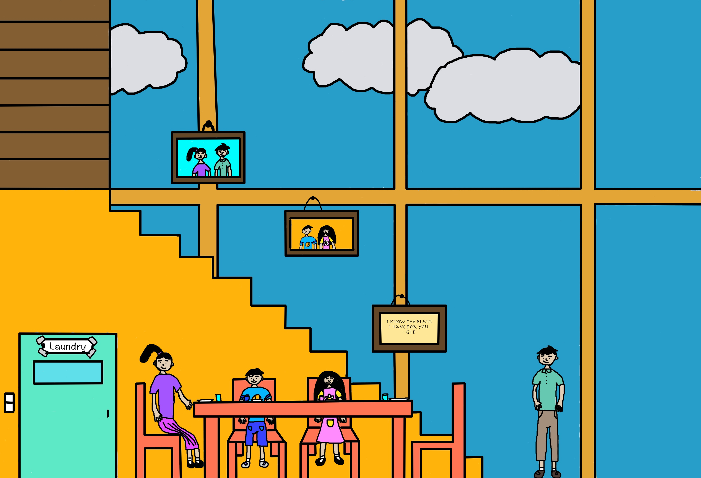
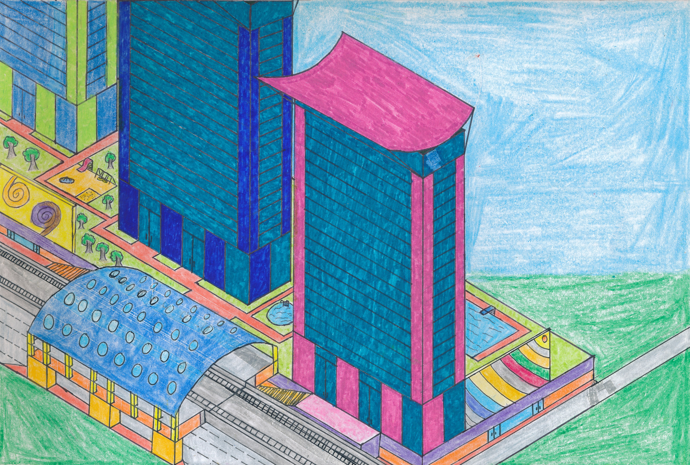
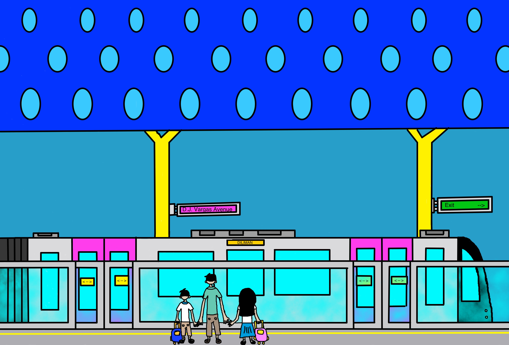

Zene and Zeanne went down the stairs and sat down on the table, where their mother, Kayla, had prepared a very delicious breakfast for them.

<section class="my-1 center-image">

</section>

"It's very scrumptious, mama!" said Zeanne.

"Same goes with me!" said Zene.

They then brushed their teeth, took a bath, and put on their school uniforms. Zene and Zeanne are already eight years old, which means that this school year, they are already in Grade Two, and the twins are really very excited.

Just then, Jamie Cruz, Zene and Zeanne's father, came to them and asked them if they are ready for their first day at school.

"Yes, indeed," said Zene.

"Me too," said Zeanne.

"That's good, because I'll bring you to school today," Jamie said.

"Horaay!" said the twins.

Before Zene, Zeanne, and Jamie left, Kayla said a short prayer for them. "Lord, may you protect my children and my husband as they go out of this house. Give my kids wisdom, O God, and bless them. Amen."

Zene, Zeanne, and Jamie then said goodbyes to Kayla, and went out of their condominium unit, which was named A4002. That name was given to that room because it is located at the topmost floor of Building A of Neon Residences and Shopping Complex, which is level 40. In turn, the name of the complex came from the fact that the buildings were painted with neon colors (thus, Building A, where Zene and Zeanne live, is colored pink, while Building B is colored blue, and Building C is colored neon green. There are also two buildings under construction, which are Building D, to be painted purple, and Building E, to be painted orange).

<figure class="my-1 center-image">
 
<figcaption style="color: white;">The Neon Residences and Shopping Complex as drawn by Zene and Zeanne.</figcaption>
</figure>

Zene, Zeanne, and Jaime then rode a very fast elevator made of just glass and steel. "This is awesome," said Zene. "You can even see for yourself how the elevator works."

The glass lift eventually stopped at level A-G (ground level of Building A), and the three left the condominium and walked through the garden which separates the buildings of the Neon Complex. They then took the staircases leading down to the Neon Shopping Complex to the right and the Julia Vargas MRT-9 Station to the left. They entered the station, and rode a train heading towards UP Diliman Station.

<section class="my-1 center-image">

</section>

They left the train at the Marcos Highway Station, and they transferred to the Katipunan MRT-2 Station, and boarded another train there. When they reached J. Ruiz Station, Zene, Zeanne, and Jaime disembarked the train and went to the twin's school, which is God's Christian Academy.

"God bless! Have fun and make friends!" Jaime shouted to his children as Zene and Zeanne were about to go into their classroom."
