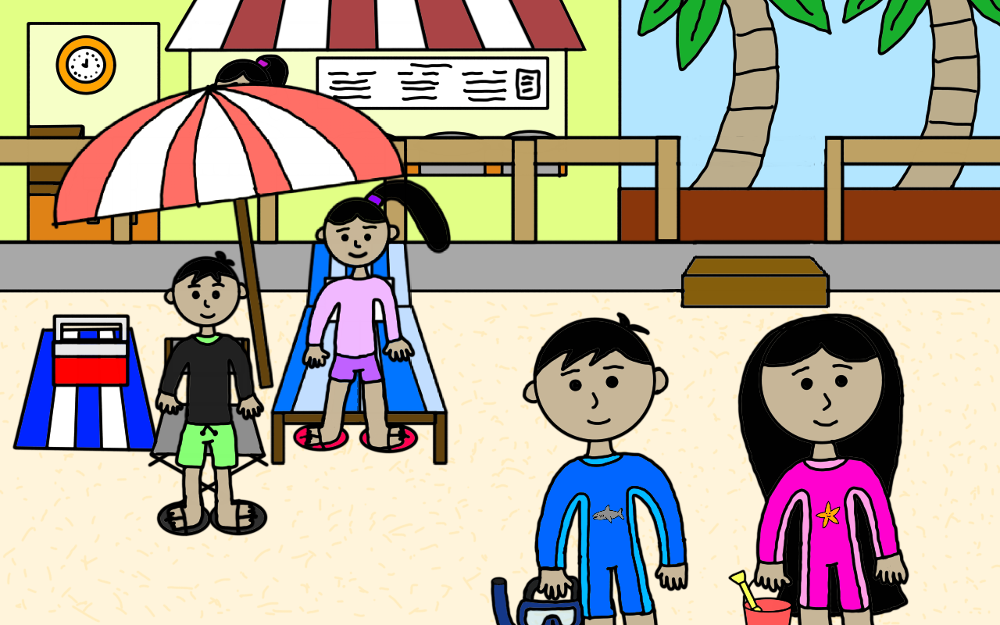
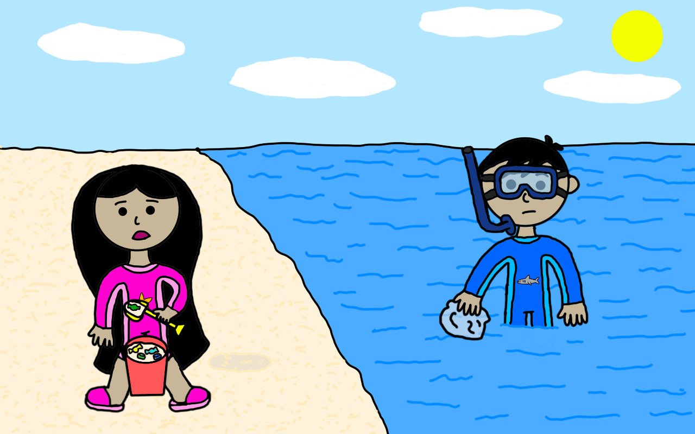
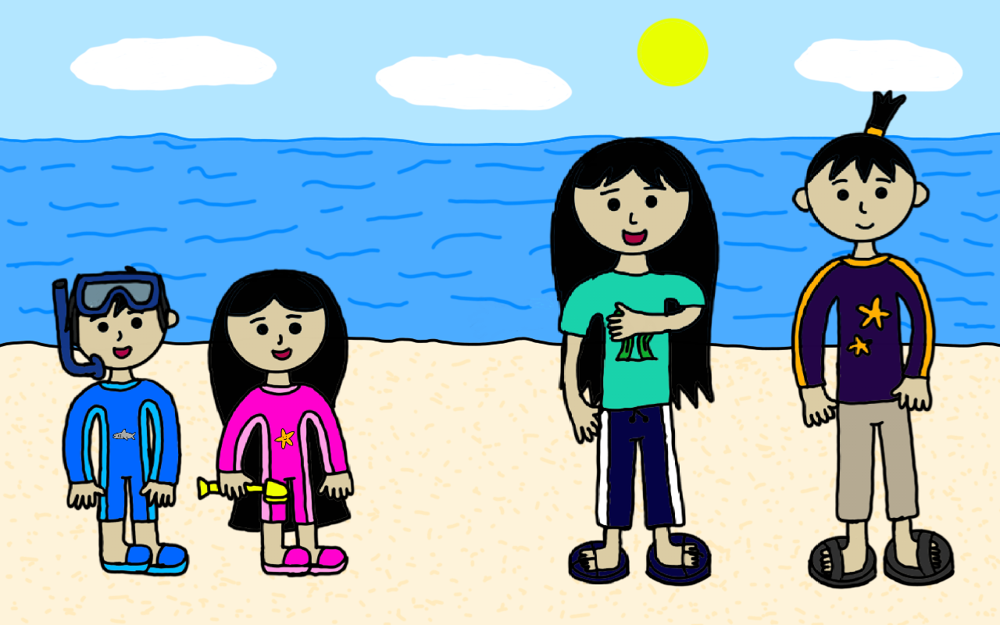
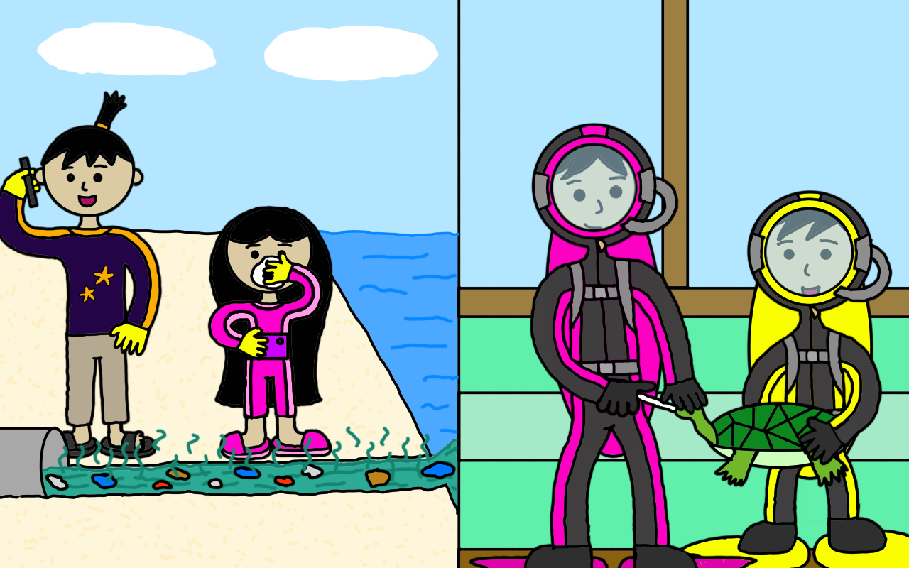

**(From Zene and Zeanne's Diary Entry)**

Well, it's been months since Bora reopened after a very long rehab project, and we want to show some gratitude to those who helped out by sharing this touching story to all of you.

<!--(A little side note: If a text is in Purple, then it's written by Zeanne, while if a text is in Orange, then it's obviously written by Zene. :) )-->

<section class="my-1 center-image">

</section>

One sunny day, the last time we went to Bora for vacation, we were looking forward to an aweZeanne day at the beach.

(Zeanne) My younger twin brother Zene wanted to go snorkeling (TBH, I know he loves exploring underwater as much as he loves exploring outer space).

(Zene) On the other hand, my older twin sister Zeanne wanted to build a sandcastle (TBH, she's more of an arts person than I am).

<section class="my-1 center-image">

</section>

But of course, reality is veeeeeery far from our expectations. We thought Bora is a beautiful white sand beach paradise, only for us to realize the hard way that it's actually full of junk! Yucks!!!!

<section class="my-1 center-image">

</section>

Well, it so happened that a bunch of High School students heard us complaining about those trash. And those High School students actually happen to be among our top fans: Mika and Jose! So we told them that we were disappointed by the trash scattered across Bora, and Jose said that, yes, it's the sad reality of Bora. Then Mika added that due to global warming and pollution, coral reefs are also dying.

But...wait for it...

They came to Bora to help save the day (they said it's a school project)! Actually, Jose is going to do some coastal clean-up while Mika is going to do coral replanting. With that said, they invited us to help out (of course, we told you that Mika and Jose are big fans of our blog, so this came as no big surprise to us then). After discussing it through with our parents, we said a big YES to them!

<section class="my-1 center-image">

</section>

(Zeanne) I decided to help out Jose in the coastal clean-up, while it's very obvious what my twin bro chose - to help out Mika in the coral replant (but trust me, Zene's a very skilled scuba diver; he has been taking diving lessons as early as 6 years old!)

(Zene) (For the record, my liking for scuba diving started all because it's related to my ultimate goal: to be an amaZene astronaut! (Actually, it was from a book I read about a girl who wants to go to Mars, just like me!))

<section class="my-1 center-image">

</section>

(Zeanne) I enjoyed helping out Jose in the coastal cleanup! It's really tiring yet fun picking up pieces of trash, including empty water bottles, plastic wraps, candy wrappers, and so on. There were even times when I discovered sachets and wrappers with designs dating back from before Zene and I were born! They really look antique (and even nostalgic for some collectors out there), and they looked either almost similar or even very different from the designs used today!

(Zene) I also had fun helping Mika replant corals. You may think it's quite complex, but it's actually very simple! Firstly, you have to be a certified scuba diver (just like me, and to be honest, you're never too young to learn how to scuba dive! Just as my twin sister mentioned earlier, I began taking scuba lessons since I was 6, but I know of other kids who did so at 10, 9, or even 8 or 7!), and of course, you need pieces of live corals, zip ties, and cross-cutters or snippers (Mika, who is of course my dive buddy, provided them). Additionally, there was a wire frame that was installed underwater by Mika, Jose, and their groupmates earlier, and this was the place where we replanted the corals. Firstly, we used the zip ties to secure the live coral pieces on the frame, then we used the cross-cutters/snippers to remove excess from the zip ties. That's it!

(Zene) Fun fact: Living Coral was named <a href="https://www.pantone.com/color-intelligence/color-of-the-year/color-of-the-year-2019" class="ext-web-link">Pantone's 2019 Color of the Year</a>. Can you count in the picture above how many corals we replanted have that color?

<section class="my-1 center-image">

</section>

(Zeanne) While we were busy picking up pieces of trash along the coastline, we smelled something funny. Jose told me that the scent came from a pipe just a few meters away. So we decided to investigate, and that pipe where the funny scent came from is actually filled with polluted water! Yucks! I even covered my nose with my handkerchief because the stench is so unbearable! Jose also observed that the pipe happened to be connected to other establishments in Boracay, so he decided to report the situation to the authorities. I also took photos of the pipe flowing with polluted water, also to report it.

(Zene) Meanwhile, while Mika and I were replanting corals, we suddenly saw a huge turtle...with some foreign object stuck into its nose. Mika saw that the turtle was struggling, and so we grabbed that turtle, and took it to our boat. Mika and I carefully removed the object that got lodged in that turtle's nose, and it happened to be a plastic spork (BTW a spork is a spoon with fork-like spikes on top of it)! It's a good thing the turtle's doing well now that we managed to remove the spork from it. I then told Mika my experience of seeing a floating plastic bag while I was snorkeling earlier, and she told me that, yes, even trash can show up in open seas or even underwater. With that, we continued scuba diving, not only replanting corals but also picking up trash either floating on water or lying on the seafloor.

<section class="my-1 center-image">

</section>

At last, our hard work was done! Mika and Jose told us that we really did a great job in helping restore the beauty of Bora, and this deserves a fist bump!

We, as humans created in the image and likeness of God, are to be good stewards of His wonderful creation. Genesis 1:28 even tells us to "...have dominion over the fish of the sea and over the birds of the heavens and over every living thing that moves on the earth" (ESV). By "dominion", we mean that we are to be responsible for everything God has created here on earth, including every living thing God has made. :)

**For More Info...**

<a href="https://www.instructables.com/id/Transplanting-Corals/" class="ext-web-link">Coral Replanting 101</a>
 
 
 
 
 
 
 
 
 
 
 
 
 
 
 
 
 
 
 
 
 
 
 
 
 
 
 
 
 
(Zene) Hang on a sec! It's not over yet!

<section class="my-1 center-image">

</section>

(Zene) After the fist bump, I told Zeanne and Jose that Mika and I saw something amaZene while we were replanting corals and picking up trash underwater. They're curious about it, so Mika and I decided that we should all go scuba diving to see what I'm talking about (after all, it seems that we deserve something special after a long day)! And they all agreed! And this creature that we all marvelled at underwater is...a whale shark (and Mika even told me that, with all the filth in Boracay's waters, seeing a whale shark there is pretty a rare feat)!

(Zene) And for the record, Zeanne's also a great scuba diver like me (it's just that, at first, she was hesitant to join me when I began learning scuba diving, because she thought to herself, "What's the use of scuba diving when I'm not planning on becoming an astronaut like my twin brother?" But eventually, she began liking it just like me, and I even told her that we could be among the best dive buddies ever in that she can take aweZeanne underwater photographs)!
